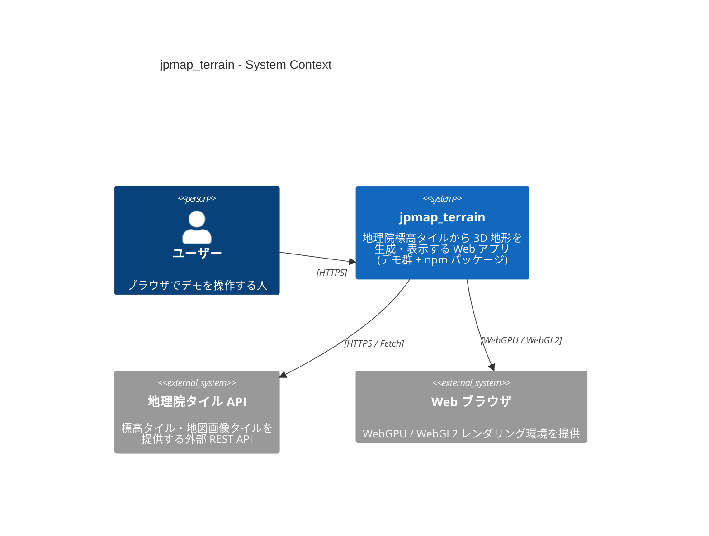
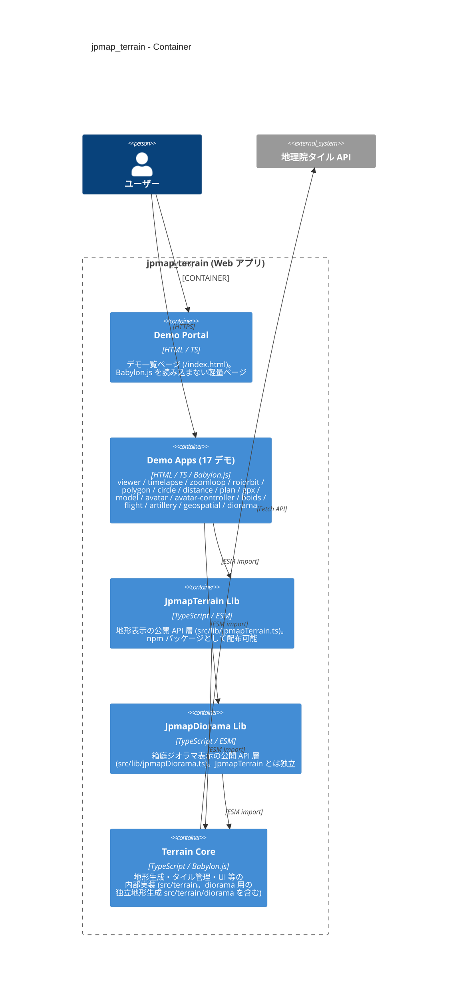
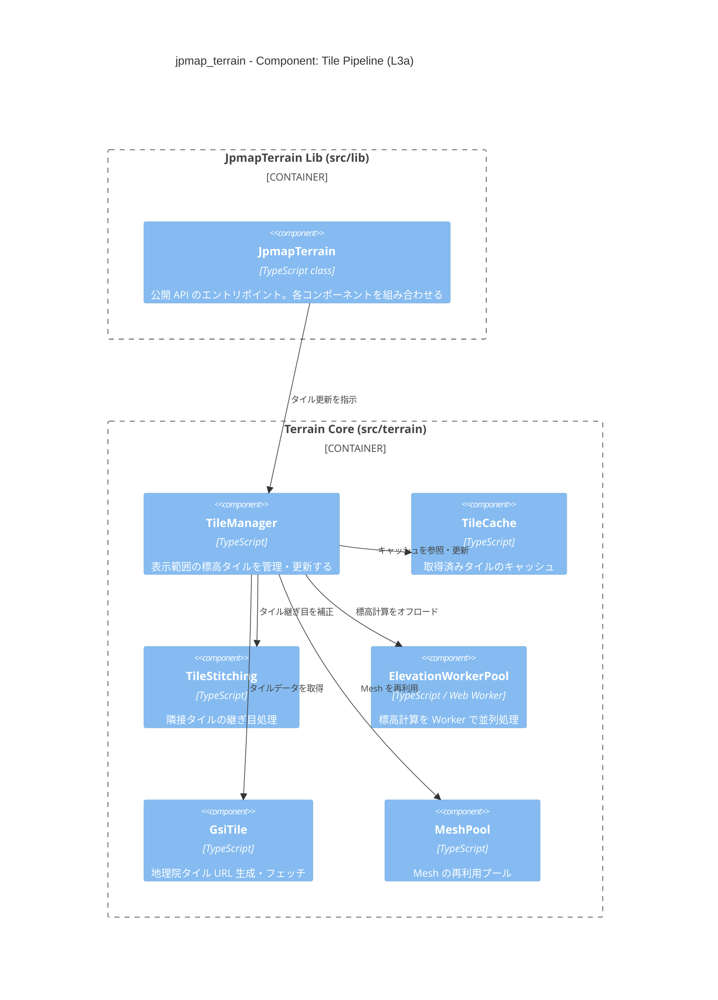
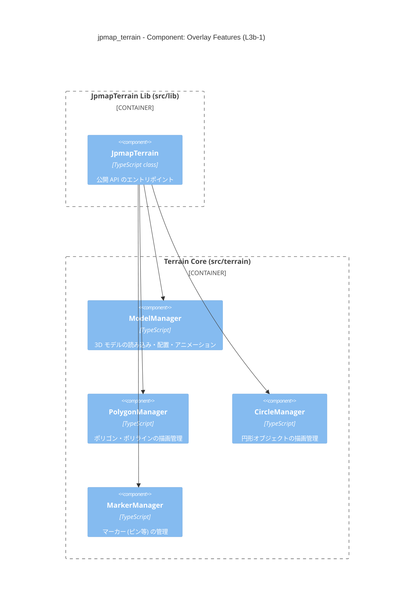
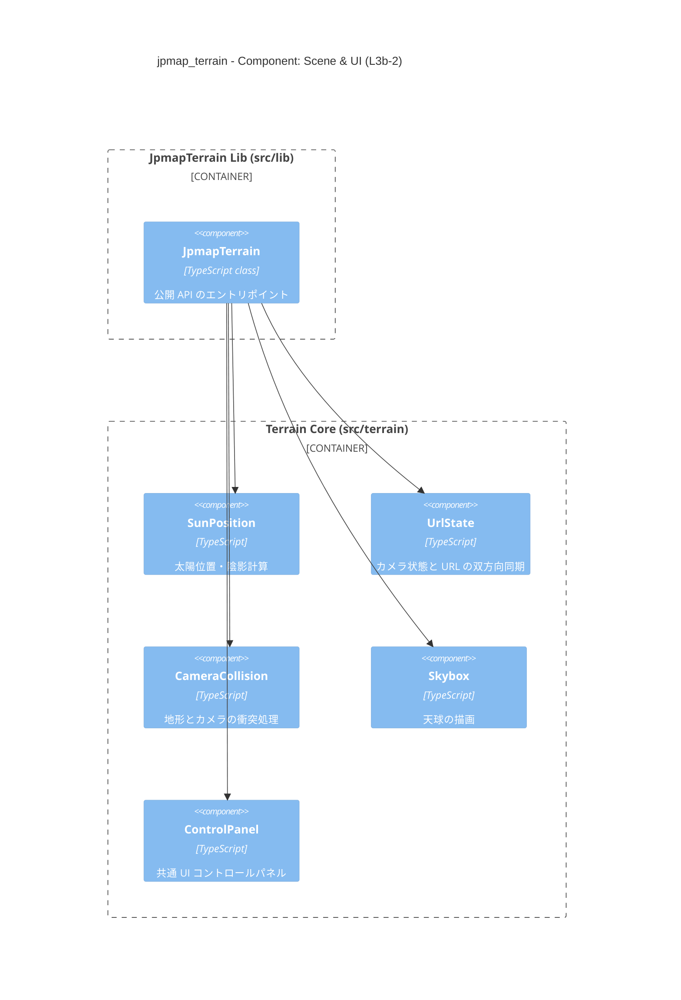
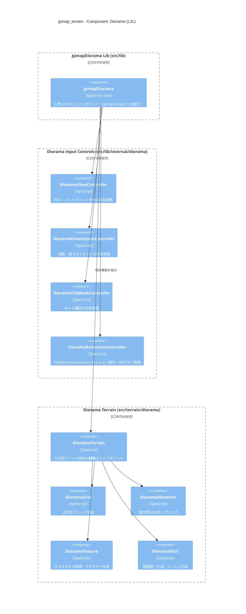

# jpmap_terrain アーキテクチャ（C4 モデル）

本ドキュメントは C4 モデル（L1〜L3）で jpmap_terrain の構造を説明します。

> 図は [Mermaid C4 記法](https://mermaid.js.org/syntax/c4.html) で記述しています。

---

## L1 – System Context

システム全体とその外部関係者・外部システムを示します。



---

## L2 – Container

jpmap_terrain 内部の主要コンテナ（デプロイ・ビルド単位）を示します。

> デモ 17 本は `manualChunks`（Vite）でコードを共有するため、独立コンテナではなく  
> **Demo Apps グループ** としてまとめます。



---

## L3 – Component

Terrain Core（`src/terrain/`）と、それを利用する公開API層（`JpmapTerrain`/`JpmapDiorama`）内の主要コンポーネントを示します。
関心の異なる4つの図に分けて記述します（L3a〜L3b-2 は `JpmapTerrain`、L3c は独立した `JpmapDiorama`）。

### L3a – Tile Pipeline

タイル取得・地形生成のデータフローを示します。



### L3b-1 – Overlay Features

JpmapTerrain が制御する地図オーバーレイ描画系コンポーネントを示します。



### L3b-2 – Scene & UI

JpmapTerrain が制御するシーン環境・カメラ・UI 系コンポーネントを示します。



### L3c – Component（Diorama）

`JpmapDiorama`（`JpmapTerrain` とは独立した第2の公開API。詳細は [`spec/diorama-api.md`](diorama-api.md)）が制御する箱庭ジオラマ表示系コンポーネントを示します。



---

## デモ × コンポーネント 対応表

各デモが主に利用する Terrain Core コンポーネントをまとめます。`JpmapTerrain` を介さない `geospatial`（`GlobeScene` を直接起動）・`diorama`（`JpmapDiorama` 経由。L3c参照）は対象外です。

| デモ               | TileManager | ModelManager | PolygonManager | CircleManager | SunPosition | UrlState |
|:-------------------|:-----------:|:------------:|:--------------:|:-------------:|:-----------:|:--------:|
| 3D 地形ビューア    |     ✅      |              |                |               |     ✅      |    ✅    |
| タイムラプス       |     ✅      |              |                |               |     ✅      |    ✅    |
| ポリゴン           |     ✅      |              |       ✅       |               |             |    ✅    |
| サークル           |     ✅      |              |                |      ✅       |             |    ✅    |
| 距離計測           |     ✅      |              |       ✅       |               |             |    ✅    |
| Plan Viewer        |     ✅      |              |       ✅       |               |             |    ✅    |
| 3D モデル          |     ✅      |      ✅      |                |               |             |    ✅    |
| アバター #01       |     ✅      |      ✅      |                |               |             |    ✅    |
| アバター #02       |     ✅      |      ✅      |                |               |             |    ✅    |
| Boids フロッキング |     ✅      |      ✅      |       ✅       |               |             |          |
| フライトデモ       |     ✅      |      ✅      |                |               |             |    ✅    |
| Artillery Game     |     ✅      |              |                |               |             |    ✅    |

---

## 外部タイル仕様と既知の制約

### 地理院タイルのズーム別カバレッジ

地図テクスチャ（`std` / `seamlessphoto`）と標高タイル（`dem5a` / `dem5b` / `dem`）は、
ズームレベルによって配信範囲が異なります。

| タイル種別 | 世界全域 | 日本周辺のみ |
|---|---|---|
| 地図テクスチャ（std / seamlessphoto） | z0–z8 | z9 以上 |
| 標高（dem5a / dem5b / dem） | — | 主に日本域（域外は no-data/404） |

z9 以上は日本周辺のみ配信され、域外のタイルは 404 を返します（地理院タイル側の仕様）。

### 全球（geospatial）ビューでのタイル選択クランプ

全球ビュー（`src/scenes/globe.ts` / `src/terrain/geo/globeLod.ts`）では、上記カバレッジに
合わせて LOD のタイル細分化を制御します。

- タイルの地理範囲が日本被覆域（`JAPAN_BOUNDS`）と交差しない場合、テクスチャの世界全域上限
  `WORLD_TEXTURE_MAX_ZOOM`（= z8, `src/terrain/gsiTile.ts`）まででタイル細分化を打ち切り、
  低レベルタイルのまま表示を維持します（域外を z9 以上へズームインしても白タイルで欠けない）。
- 域外の標高は実データが無いため、海面高度 0m のフラット建築で扱います。

### 既知の制約（仕様）

- **日本域と域外の境界では、z9 以上で白タイルになる部分が存在します。** これは、日本被覆域と
  交差する境界付近のタイルが z9 以上へ細分化される一方、その範囲に含まれる域外側にはテクスチャ
  （z9 以上）が存在しない（地理院タイルの配信仕様）ことに起因します。境界部に限定された挙動で、
  仕様として許容します。

### タイル解像度の緯度依存（標高サンプリング精度）

地理院タイルは Web Mercator（EPSG:3857）投影で配信されるため、**同一ズームレベルでも 1px
あたりの地表解像度は緯度に依存します**。256px タイル時の地表解像度は次式で近似できます。

```
解像度[m/px] ≈ 156543.03 × cos(緯度) / 2^zoom
```

- ズームが 1 上がるごとに解像度は約 1/2 になります。
- 緯度が高い（極側）ほど `cos(緯度)` が小さくなり解像度は細かく、低緯度（赤道側）ほど粗く
  なります。例: zoom=18 では赤道で約 0.60 m/px、東京付近（北緯約 35.7°）で約 0.49 m/px。

標高メッシュは離散的な頂点格子の平面近似であるため、滑らかな実地形に対して頂点間隔オーダーの
**離散化誤差**が残ります（pick/レイキャストで取得する地形高さの誤差は、pick 自体の精度ではなく
この格子解像度に支配される）。十分高いズームでは
誤差は数十 cm 以下に収まりますが、上記のとおり**到達できる絶対精度は緯度によって変動する**点を
制約として扱います。低緯度域では同一ズームでも高緯度域より粗くなることに留意してください。
