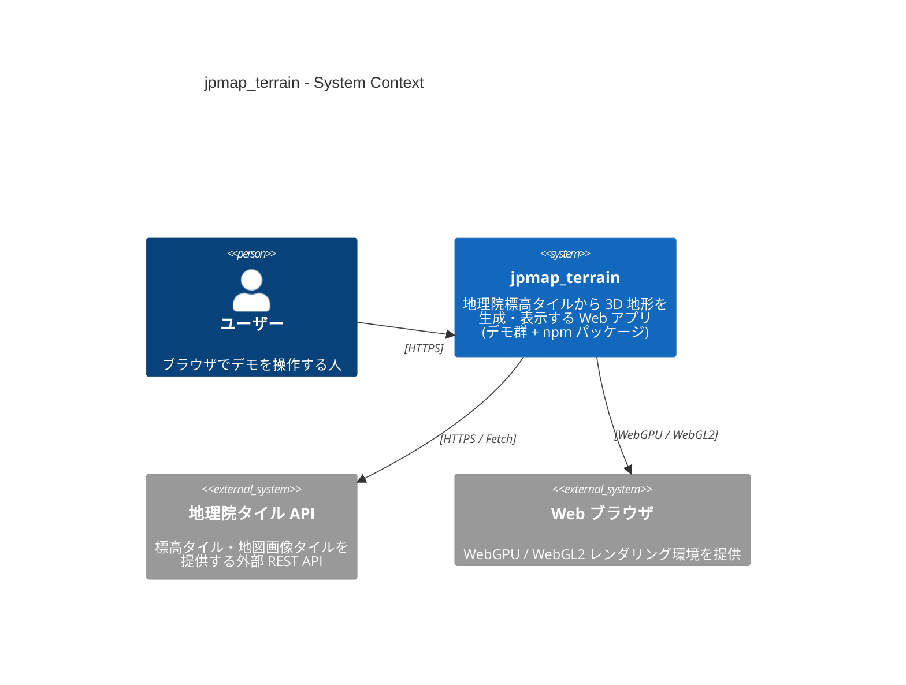
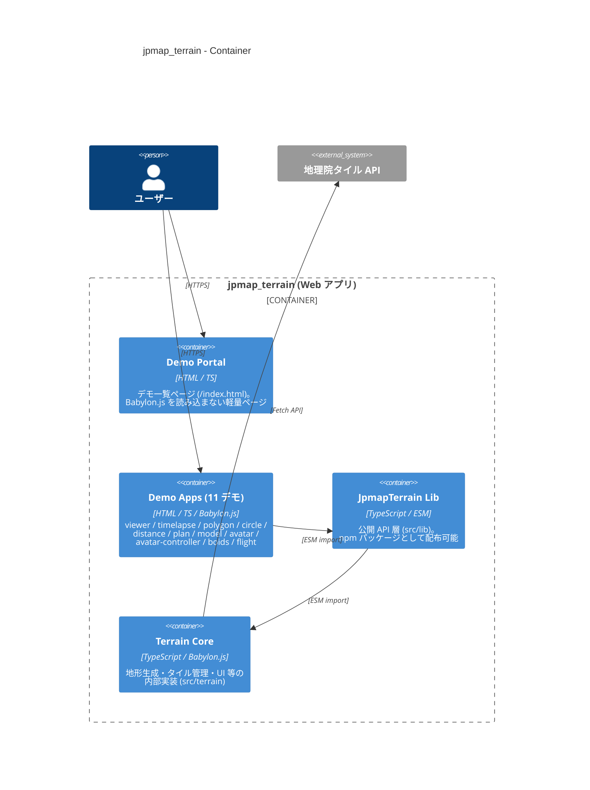
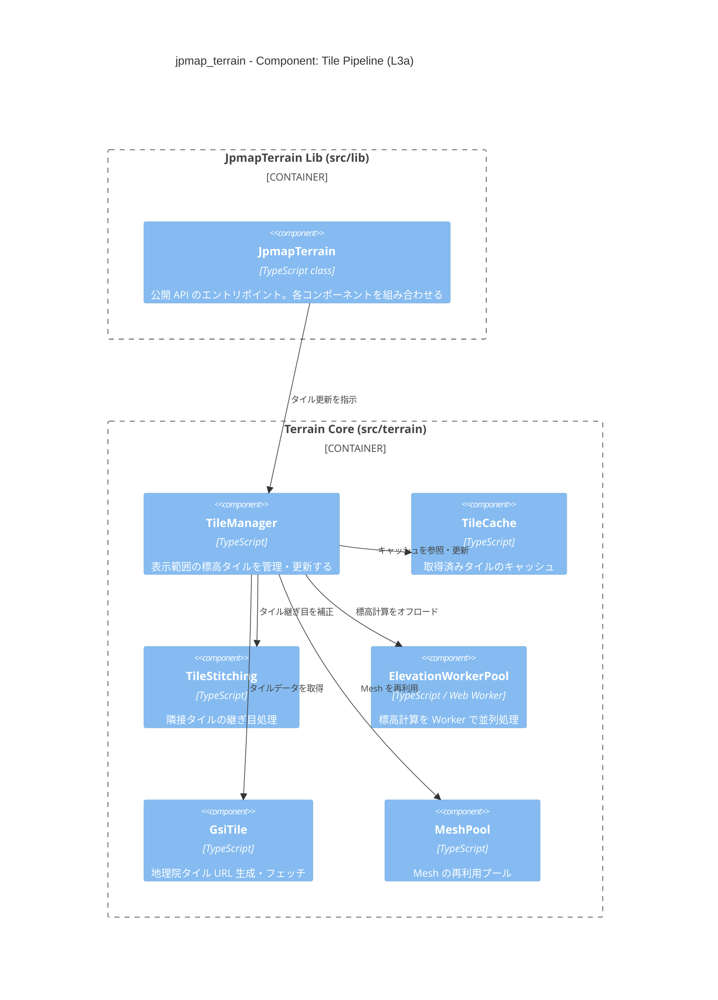
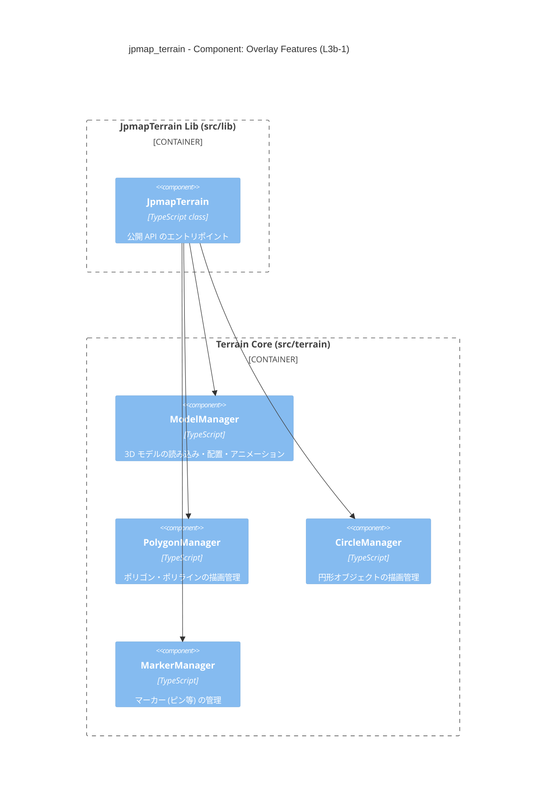
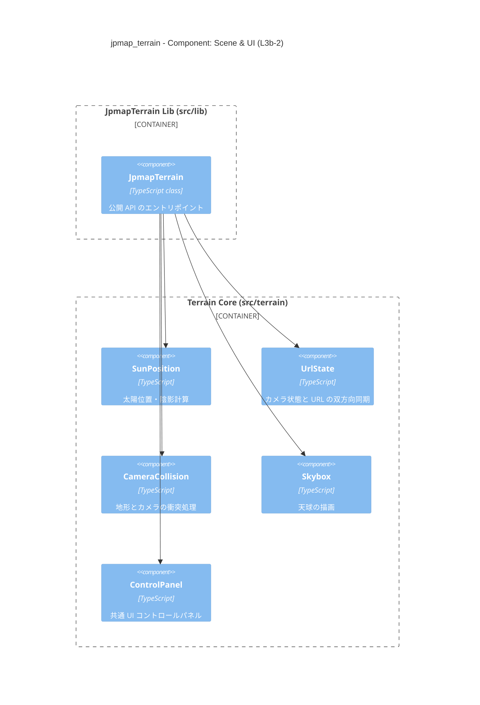

# jpmap_terrain アーキテクチャ（C4 モデル）

本ドキュメントは C4 モデル（L1〜L3）で jpmap_terrain の構造を説明します。

> 図は [Mermaid C4 記法](https://mermaid.js.org/syntax/c4.html) で記述しています。

---

## L1 – System Context

システム全体とその外部関係者・外部システムを示します。

---

## L2 – Container

jpmap_terrain 内部の主要コンテナ（デプロイ・ビルド単位）を示します。

> デモ 11 本は `splitChunks` でコードを共有するため、独立コンテナではなく  
> **Demo Apps グループ** としてまとめます。

---

## L3 – Component（Terrain Core）

Terrain Core（`src/terrain/`）内の主要コンポーネントを示します。
関心の異なる3つの図に分けて記述します。

### L3a – Tile Pipeline

タイル取得・地形生成のデータフローを示します。

### L3b-1 – Overlay Features

JpmapTerrain が制御する地図オーバーレイ描画系コンポーネントを示します。

### L3b-2 – Scene & UI

JpmapTerrain が制御するシーン環境・カメラ・UI 系コンポーネントを示します。

---

## デモ × コンポーネント 対応表

各デモが主に利用する Terrain Core コンポーネントをまとめます。

| デモ               | TileManager | ModelManager | PolygonManager | CircleManager | SunPosition | UrlState |
|:-------------------|:-----------:|:------------:|:--------------:|:-------------:|:-----------:|:--------:|
| 3D 地形ビューア    |     ✅      |              |                |               |     ✅      |    ✅    |
| タイムラプス       |     ✅      |              |                |               |     ✅      |    ✅    |
| ポリゴン           |     ✅      |              |       ✅       |               |             |    ✅    |
| サークル           |     ✅      |              |                |      ✅       |             |    ✅    |
| 距離計測           |     ✅      |              |       ✅       |               |             |    ✅    |
| Plan Viewer        |     ✅      |              |       ✅       |               |             |    ✅    |
| 3D モデル          |     ✅      |      ✅      |                |               |             |    ✅    |
| アバター #01       |     ✅      |      ✅      |                |               |             |    ✅    |
| アバター #02       |     ✅      |      ✅      |                |               |             |    ✅    |
| Boids フロッキング |     ✅      |      ✅      |       ✅       |               |             |          |
| フライトデモ       |     ✅      |      ✅      |                |               |             |    ✅    |
